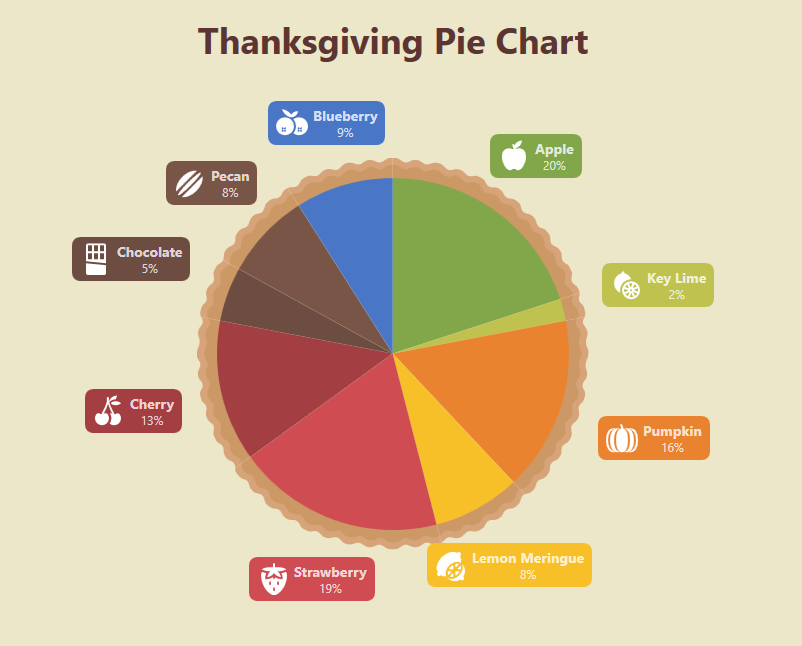

<!-- default file list -->
*Files to look at*:

* [MainWindow.xaml](./CS/WpfApplication2/MainWindow.xaml)
<!-- default file list end -->

# How to: Implement a Custom Model for a Pie Chart Slice

This example shows how to create a custom model for a Pie Series slice.

